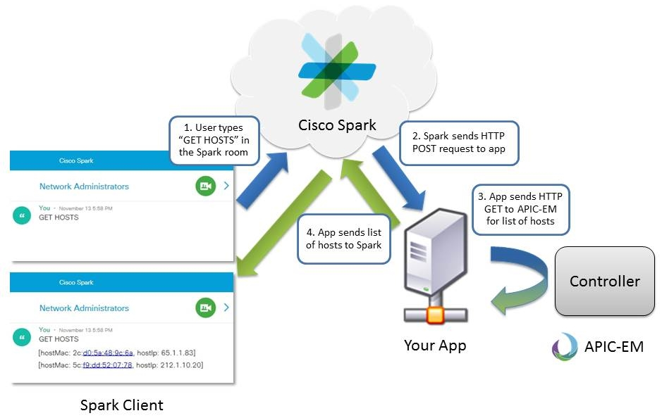
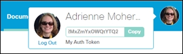

# Cisco Spark Webhooks Sample App

**Description**: Scripts for creating a Spark webhook to get notified of new messages in a Spark room, filter the messages, trigger a request to get data from APIC-EM's controller, and then post the data in a Spark room.

- **Technology stack**: Python 3.4 and Flask 0.10.1
- **Status**:  First release v1.1 [CHANGELOG](CHANGELOG.md).
- **Tutorial**: This sample code accompanies the 'Spark - Webhooks Intermdiate' learning lab at https://learninglabs.cisco.com

## Installation

You will need to install [Python 3.4](https://www.python.org/downloads/), the [Requests](http://docs.python-requests.org/en/latest/user/install/) library, and [Flask](http://flask.pocoo.org/) to run the application.

This sample app consists of the following Python files:
  * getrooms.py
  * postwebhook.py
  * webhookapp.py
  * getmessage.py
  * gethosts.py
  * postmessage.py

> These files are for your reference. You won't be able to run the app unless you host the app on a publicly reachable IP address or domain. For this reason we are hosting the app in the Cisco Sandbox at 10.10.10.10.

If you are running **Mac** or **Linux**, place the files in the following folder structure:
* /bin
  * getrooms.py
  * postwebhook.py
  * webhookapp.py
* /lib/pythonX.X/site-packages/
  * getmessage.py
  * gethosts.py
  * postmessage.py

If you are running **Windows**, place the files in the following folder structure:
  * /Scripts
    * getrooms.py
    * postwebhook.py
    * webhookapp.py
  * /Lib/site-packages
    * getmessage.py
    * gethosts.py
    * postmessage.py

## Usage

* Retrieve your Spark API Access Token.  This token is your developer token, and can be used to access **Spark** APIs during exploration and development:
  * Open a browser tab, navigate to the [developer.ciscospark.com](https://developer.ciscospark.com/?utm_source=Llab4&utm_medium=readme&utm_campaign=spark), and **Login**
  * Click on your profile image
  * Click **Copy** to copy your access token to the clipboard

## Getting help

Cisco DevNet support is available here: https://developer.cisco.com/site/devnet/support/

## Getting involved

Suggestions and enhancements welcome, see [CONTRIBUTING](CONTRIBUTING.md).

----

## Open source licensing info
[LICENSE](LICENSE)
